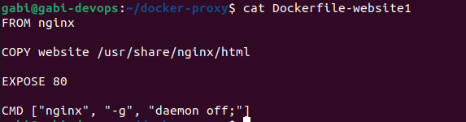
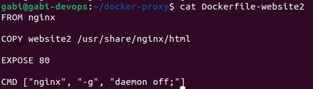
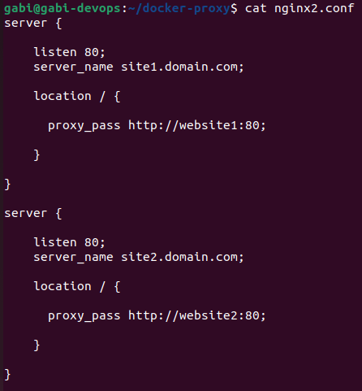
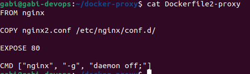
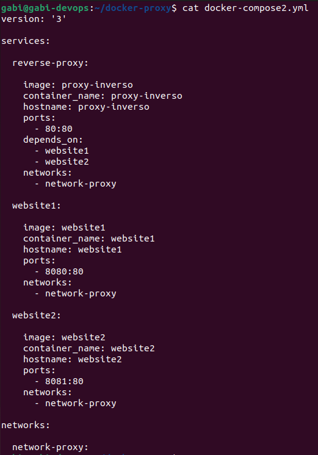
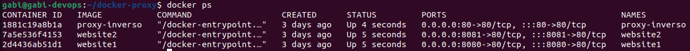
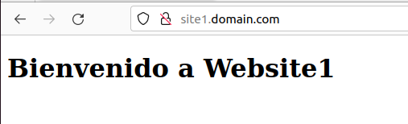

# Reverse Proxy con Docker

**Nombre:** Gabriel Pacheco Yáñez

## ***Introducción*** 

En esta práctica vamos a implementar un proxy inverso o reverse proxy en Docker. Para ello haremos uso de 3 contenedores basándonos en la imagen de NGINX oficial de Docker Hub. Previamente a la creación de los contenedores creareamos 3 ficheros Dockerfile, en 2 se hostearán 2 páginas web con un HTML muy sencillo con el único propósito de comprobar el el correcto funcionamiento de estos. En el fichero Dockerfile restante alojaremos la configuración del reverse proxy en el fichero nginx.conf. Para construir las imágenes a partir de los ficheros Dockerfile emplearemos el comando docker build.

Una vez tengamos las 3 imágenes creadas, crearemos un fichero docker-compose.yml con un servicio por cada contenedor en el que especificaremos los ajustes necesarios para conseguir que la arquitectura del reverse proxy planteada se cumpla.

## ***Dockerfiles***

Para construir las imágenes en las que se van a basar nuestros contenedores, tendremos que crear los ficheros Dockerfile primero. 

Empezaremos creando los Dockerfile de nuestras páginas web, estos serán idénticos menos la carpeta de recursos de nuestra máquina local que copiaremos dentro del directorio /usr/share/nginx/html dentro de la imagen para que NGINX pueda correr nuestra página HTML dentro del contenedor.

**Dockerfile website1:**

Con COPY copiamos la carpeta de recursos de nuestra máquina local dentro a la ruta especificada dentro de la imagen.

Con EXPOSE abrimos el puerto 80 del contenedor para hacerlo accesible.

Con CMD ejecutamos el comando especificado para correr NGINX al crear una instancia de la imagen.

**Dockerfile website2**

Lo único que diferencia este Dockerfile del anterior es la carpeta desde donde se copian los recursos a la ruta /usr/share/nginx/html dentro de la imagen.

**Dockerfile reverse-proxy**

Antes de crear el Dockerfile para el contenedor donde vamos a implementar la configuración del reverse-proxy, tenemos que crear un fichero nginx.conf donde especificaremos todos los detalles para que se redirija todo el tráfico a los contenedores de las páginas web que estarán corriendo posteriormente cuando levantemos las respectivas imágenes con el fichero docker-compose.yml.

En este fichero de configuración se detalla con las directivas server_name que virtual host se tiene que introducir en el navegador de la máquina local para que redirija el tráfico al contenedor que está corriendo el HTML de website1 y website2. Con la directiva proxy_pass especificamos el nombre del contenedor y el puerto expuesto donde queremos que se redirija el tráfico al introducir la url especificada en server_name en el navegador.

Al terminar de haber configurado el fichero nginx.conf, tendremos que copiarlo a la ruta /etc/nginx/conf.d dentro de la imagen donde implementaremos el reverse proxy con COPY adentro del fichero Dockerfile.

Una vez creado los ficheros Dockerfile, podemos crear las imágenes con el comando docker build, con la flag "-t" podremos especificar un nombre para la imagen y con "-f" podremos especificar el nombre del archivo Dockerfile.

Tras haber acabado de crear las imágenes a partir de los ficheros Dockerfile, dispondremos de 3 imágenes: website1, website2 y proxy-inverso, que emplearemos a continuación dentro del fichero docker-compose.yml para el levantamiento de los contenedores y la comprobación del funcionamiento del reverse-proxy.

## **Docker Compose**

Dentro de la directiva services, especificamos todos los servicios/contenedores que vamos a levantar. Especificamos de qué imagen nos vamos a basar con image, el nombre del contenedor con container_name, el nombre del host del contenedor con hostname, los puertos del contenedor que van a ser mapeados a la máquina local con ports, la red que se va a emplear con networks, y por último con la directiva depends_on, se lista que servicios tienen que iniciarse antes del servicio donde se añade esta directiva. Esto lo hacemos en el servicio reverse-proxy porque si este se iniciara antes el docker-compose up nos daría un error, ya que, el nombre de los contenedores está especificado en el fichero nginx.conf, por lo tanto estos necesitan levantarse primero para que el proxy inverso funcione correctamente.

Podemos ejecutar el fichero docker-compose.yml con el comando docker-compose up -d. Si nuestro fichero tiene un nombre diferente a docker-compose.yml podemos añadir el flag "-f" y añadir el nombre de nuestro fichero.

Para comprobar que los contenedores se han levantado podemos ejecutar el comando docker ps.

## **Comprobación**

Finalmente, para comprobar el correcto funcionamiento del reverse-proxy, introduciremos en el navegador las urls añadidas dentro del fichero nginx.conf para confirmar que nos reproduce los HTML alojados dentro de los otros 2 contenedores donde se están alojando las páginas web.

**Website1**

**Website2**

